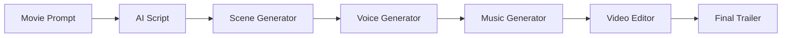

<div align="center">

# 🎬 AI Movie Trailer Generator

### 🚀 Transform Any Movie Idea into a Cinematic AI Trailer

Generate scripts, scenes, voiceovers, background music, and fully edited cinematic trailers using Artificial Intelligence.
</p>
<p align="center">


</p>
## 🎥 Live Demo


https://github.com/user-attachments/assets/a5001994-f7b0-46aa-ba77-3d9a2102ba0a


# 🚀 Live Notebook

<p align="center">

### 💻 Run Instantly in Google Colab

<a href="https://colab.research.google.com/drive/1PiRg9YcN4vmqEHf6ztNkn8MhovBOyStD?usp=sharing">

</a>

</p>

No installation required.

Simply open the notebook in **Google Colab**, add your API key (if required), and make your Futuristic Movie Trailer .

---

## 📌 About the Project
✨ Generates scripts

🎬 Creates scenes

🎤 Voice generation

🎵 Background music

🎞 Automatic editing

⚡ End-to-End AI pipeline

🧠 Prompt Engineering

🤖 AI Powered

🚀 One-click generation



## 📂 Project Structure

```text
📦 AI-Movie-Trailer
│
├── 📄 main.py
├── 📄 script_generator.py
├── 📄 video_generator.py
├── 📄 audio_generator.py
├── 📄 video_editor.py
├── 📁 assets/
├── 📁 outputs/
├── 📄 requirements.txt
└── 📄 README.md
```

 
 ## 🛠 Tech Stack


```bash
git clone https://github.com/username/AI-Movie-Trailer.git
```

```bash
cd AI-Movie-Trailer
```

```bash
pip install -r requirements.txt
```

```bash
python main.py
```
💡 Prompt

↓

📝 AI Script

↓

🎨 Scene Generation

↓

🎤 Voice Generation

↓

🎵 Music

↓

🎬 Editing

↓

📦 Final Trailer
| Feature              | Supported |
| -------------------- | --------- |
| AI Script Generation | ✅         |
| Voice Generation     | ✅         |
| Image Generation     | ✅         |
| Video Editing        | ✅         |
| Background Music     | ✅         |
| One-click Pipeline   | ✅         |
## 👨‍💻 Author

**Yuvraj Singh**

AI | Machine Learning | Generative AI

[](www.linkedin.com/in/yuvrajsingh0712)

[](https://github.com/Yuvraj-Singh0712)
## ⭐ Support

If you found this project useful,

⭐ Star this repository

🍴 Fork it

🛠 Contribute

💬 Share your feedback
<div align="center">

Made with ❤️ using Python & Artificial Intelligence

⭐ Thanks for visiting ⭐

</div>
